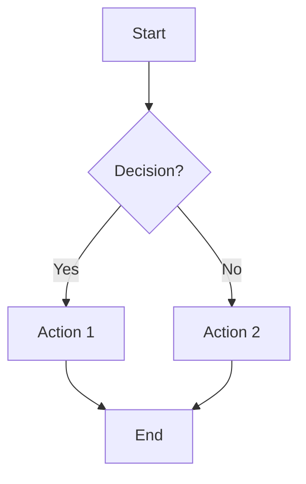
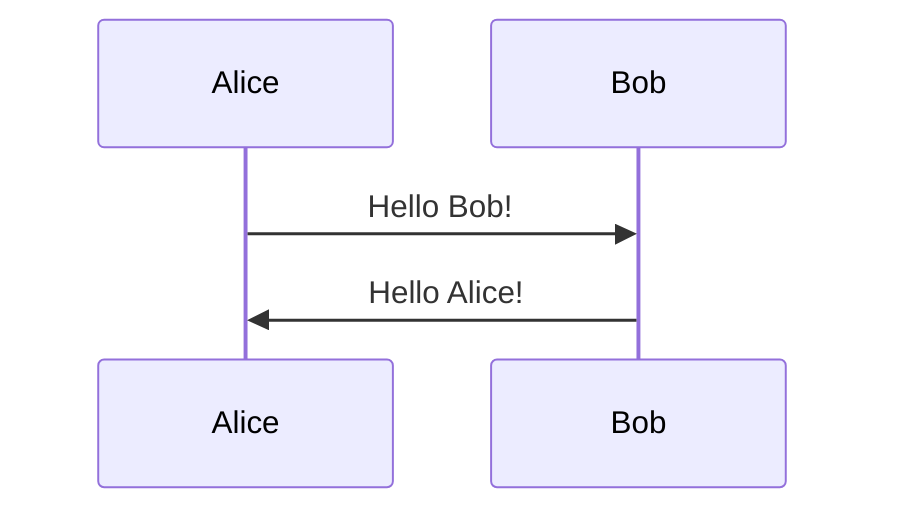
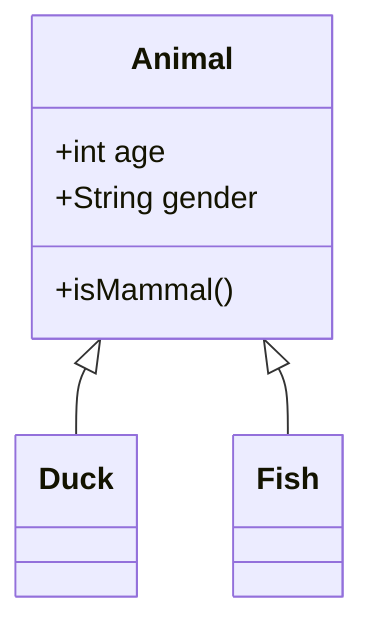
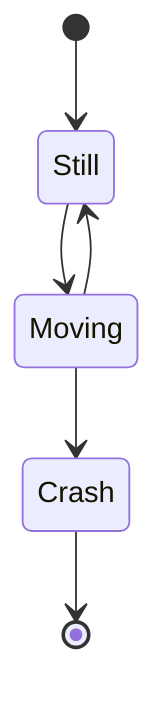
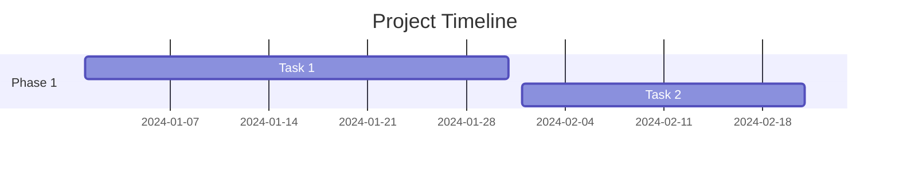
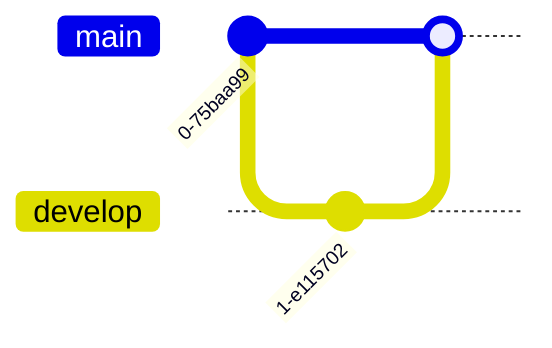

# Kroki.py - Dokumentation

## Überblick

`kroki.py` ist ein Batch-Konvertierungs-Tool für Mermaid-Diagramme. Es konvertiert alle `.mmd` Dateien im `mermaid/` Unterverzeichnis automatisch zu SVG- und PNG-Bildern über die Kroki.io API.

## Verwendungszweck

Das Script automatisiert die Konvertierung von Mermaid-Diagrammen, indem es:
- Alle .mmd Files im `mermaid/` Verzeichnis findet
- Jedes Diagramm zu SVG und/oder PNG konvertiert
- Automatische Versionierung verhindert Überschreiben
- Output in separate `svg/` und `png/` Verzeichnisse speichert

## Installation

### Voraussetzungen

```bash
# Python 3.8 oder höher
python --version

# Requests library installieren
pip install requests
```

### Benötigte Bibliotheken

- `requests` - HTTP-Anfragen an Kroki.io API
- `pathlib` - Dateipfad-Handling
- `argparse` - CLI-Argument-Parsing
- Standard Python Libraries (sys, typing, etc.)

## Verwendung

### Basis-Verwendung

```bash
# Im docs/ Verzeichnis
cd docs/

# Konvertiere alle .mmd Files zu SVG + PNG
python kroki.py --format all

# Nur SVG
python kroki.py --format svg

# Nur PNG
python kroki.py --format png
```

### Hilfe anzeigen

```bash
python kroki.py --help
```

**Output:**
```
usage: kroki.py [-h] [--format {svg,png,all}]

Kroki.io Mermaid Converter - Convert all .mmd files to SVG/PNG

options:
  -h, --help            show this help message and exit
  --format {svg,png,all}
                        Export format (default: all)

Das Script konvertiert alle .mmd Dateien im mermaid/ Verzeichnis
zu SVG und/oder PNG über die Kroki.io API.

Output-Struktur:
  ./svg/filename_00.svg, filename_01.svg, ...
  ./png/filename_00.png, filename_01.png, ...

Beispiele:
  python kroki.py --format all    # SVG + PNG (Standard)
  python kroki.py --format svg    # Nur SVG
  python kroki.py --format png    # Nur PNG
```

## Verzeichnisstruktur

### Input

```
docs/
└── mermaid/
    ├── flowchart.mmd
    ├── research_dependencies.mmd
    └── research_workflow.mmd
```

### Output

```
docs/
├── svg/
│   ├── flowchart_00.svg
│   ├── flowchart_01.svg         # bei erneutem Export
│   ├── research_dependencies_00.svg
│   └── research_workflow_00.svg
└── png/
    ├── flowchart_00.png
    ├── flowchart_01.png
    ├── research_dependencies_00.png
    └── research_workflow_00.png
```

## Funktionsweise

### Prozess-Flow

```
┌────────────────────┐
│ Script Start       │
└─────────┬──────────┘
          │
          ▼
┌────────────────────┐
│ Parse CLI Args     │
│ (--format)         │
└─────────┬──────────┘
          │
          ▼
┌────────────────────┐
│ Finde alle .mmd    │
│ in mermaid/        │
└─────────┬──────────┘
          │
          ▼
┌────────────────────┐
│ Für jedes File:    │
│ ├─ Lese Content    │
│ ├─ Prüfe Version   │
│ ├─ Konvertiere SVG │
│ └─ Konvertiere PNG │
└─────────┬──────────┘
          │
          ▼
┌────────────────────┐
│ Zeige Summary      │
│ (Success/Errors)   │
└────────────────────┘
```

### Versionierungs-Algorithmus

```python
def get_next_version_filename(output_dir, basename, ext):
    """
    Findet nächste freie Versionsnummer
    """
    version = 0
    while True:
        path = output_dir / f"{basename}_{version:02d}.{ext}"
        if not path.exists():
            return path
        version += 1

# Beispiel:
# flowchart_00.svg existiert → flowchart_01.svg
# flowchart_01.svg existiert → flowchart_02.svg
# ...
# flowchart_99.svg existiert → flowchart_100.svg (dreistellig)
```

## Konvertierungs-Prozess

### 1. Mermaid zu SVG/PNG

```
┌──────────────┐
│ .mmd File    │
│ (Mermaid)    │
└──────┬───────┘
       │
       ▼
┌──────────────┐     HTTP POST
│ Kroki.io API │ ◄─────────────┐
│ Renderer     │                │
└──────┬───────┘                │
       │                        │
       ▼                        │
┌──────────────┐                │
│ SVG/PNG      │                │
│ Binary       │                │
└──────┬───────┘                │
       │                        │
       ▼                        │
┌──────────────┐                │
│ Schreibe     │                │
│ zu Datei     │                │
└──────────────┘                │
                                │
   ┌────────────────────────────┘
   │
   │ POST https://kroki.io/mermaid/{format}
   │ Content-Type: text/plain
   │ Body: Mermaid diagram code
```

### 2. API-Request Details

```python
url = f"https://kroki.io/mermaid/{format}"  # svg oder png

response = requests.post(
    url,
    headers={"Content-Type": "text/plain"},
    data=mermaid_code.encode("utf-8"),
    timeout=30
)

# Response enthält Bild-Binärdaten
with open(output_path, "wb") as f:
    f.write(response.content)
```

## Output-Beispiel

### Console-Output

```
============================================================
Kroki.io Mermaid Converter
============================================================
Directory: /media/heimwerker/Work-Data/Coding/med_db_research_tool/docs
Files found: 3
Formats: SVG, PNG
============================================================

📄 Processing: flowchart.mmd
  ✓ SVG: flowchart_00.svg (168,249 bytes)
  ✓ PNG: flowchart_00.png (247,349 bytes)

📄 Processing: research_dependencies.mmd
  ✓ SVG: research_dependencies_00.svg (30,456 bytes)
  ✓ PNG: research_dependencies_00.png (100,235 bytes)

📄 Processing: research_workflow.mmd
  ✓ SVG: research_workflow_00.svg (455,472 bytes)
  ✓ PNG: research_workflow_00.png (242,318 bytes)

============================================================
Summary
============================================================
Files processed: 3
Exports successful: 6
Exports failed: 0
============================================================

✓ All exports completed successfully!
```

## Fehlerbehandlung

### Häufige Fehler und Lösungen

#### 1. Keine .mmd Files gefunden

**Fehler:**
```
⚠ No .mmd files found in current directory
  Searched in: /path/to/docs
```

**Lösung:**
- Überprüfen Sie, ob `docs/mermaid/` Verzeichnis existiert
- Stellen Sie sicher, dass .mmd Files vorhanden sind
- Führen Sie Script aus `docs/` Verzeichnis aus

#### 2. Requests library fehlt

**Fehler:**
```
✗ Error: requests library not found
  Install with: pip install requests
```

**Lösung:**
```bash
pip install requests
```

#### 3. Netzwerkfehler

**Fehler:**
```
✗ Error: Request timeout for SVG
```

**Lösung:**
- Internet-Verbindung prüfen
- Kroki.io API-Status prüfen: https://kroki.io
- Firewall-Einstellungen überprüfen
- Proxy-Konfiguration (falls nötig)

#### 4. Ungültiges Mermaid-Diagramm

**Fehler:**
```
✗ Error: HTTP 400 for SVG
  Response: Syntax error in Mermaid diagram
```

**Lösung:**
- Mermaid-Syntax validieren
- Online Mermaid Editor testen: https://mermaid.live
- Fehlerhafte Zeile korrigieren

#### 5. Dateizugriffs-Fehler

**Fehler:**
```
✗ Failed to read file: Permission denied
```

**Lösung:**
- Datei-Berechtigungen prüfen
- Als Administrator/Root ausführen (falls nötig)
- Schreibrechte für output-Verzeichnisse prüfen

## Mermaid-Diagramm-Typen

Das Script unterstützt alle Mermaid-Diagramm-Typen:

### 1. Flowchart



### 2. Sequence Diagram



### 3. Class Diagram



### 4. State Diagram



### 5. Gantt Chart



### 6. Git Graph



## Best Practices

### 1. Datei-Organisation

```
docs/
├── mermaid/               # Alle .mmd Source Files
│   ├── architecture.mmd
│   ├── workflow.mmd
│   └── dependencies.mmd
├── svg/                   # Generierte SVGs (gitignored)
├── png/                   # Generierte PNGs (gitignored)
└── kroki.py              # Konvertierungs-Script
```

### 2. Versionierungs-Workflow

```bash
# Nach Änderungen an .mmd Files
cd docs/
git add mermaid/*.mmd
git commit -m "Update diagrams"

# Lokal konvertieren
python kroki.py --format all

# SVG/PNG werden NICHT committed (sind in .gitignore)
```

### 3. Continuous Integration

```yaml
# .github/workflows/diagrams.yml
name: Generate Diagrams

on:
  push:
    paths:
      - 'docs/mermaid/*.mmd'

jobs:
  generate:
    runs-on: ubuntu-latest
    steps:
      - uses: actions/checkout@v2
      - name: Setup Python
        uses: actions/setup-python@v2
        with:
          python-version: '3.8'
      - name: Install dependencies
        run: pip install requests
      - name: Generate diagrams
        run: cd docs && python kroki.py --format all
      - name: Upload artifacts
        uses: actions/upload-artifact@v2
        with:
          name: diagrams
          path: |
            docs/svg/
            docs/png/
```

### 4. Batch-Processing

```bash
#!/bin/bash
# generate_diagrams.sh

cd docs/

# Backup alte Versionen
mkdir -p backups/$(date +%Y%m%d)
cp svg/*.svg backups/$(date +%Y%m%d)/ 2>/dev/null || true
cp png/*.png backups/$(date +%Y%m%d)/ 2>/dev/null || true

# Neue Diagramme generieren
python kroki.py --format all

echo "Diagrams generated successfully!"
```

## Performance

### Konvertierungs-Zeiten

| Diagramm-Größe | Format | Zeit |
|----------------|--------|------|
| Klein (<50 Zeilen) | SVG | 1-2s |
| Klein (<50 Zeilen) | PNG | 2-3s |
| Mittel (50-200 Zeilen) | SVG | 2-4s |
| Mittel (50-200 Zeilen) | PNG | 3-5s |
| Groß (>200 Zeilen) | SVG | 4-8s |
| Groß (>200 Zeilen) | PNG | 5-10s |

### Batch-Performance

| Anzahl Files | Formats | Gesamtzeit |
|--------------|---------|------------|
| 5 | SVG + PNG | 10-30s |
| 10 | SVG + PNG | 20-60s |
| 20 | SVG + PNG | 40-120s |

**Hinweis:** Zeit hängt von:
- Internet-Geschwindigkeit
- Kroki.io Server-Auslastung
- Diagramm-Komplexität

## Erweiterte Funktionen

### Custom Kroki Server

Verwenden Sie eigenen Kroki-Server:

```python
# In kroki.py
KROKI_API_URL = "http://localhost:8000"  # Lokaler Server
# oder
KROKI_API_URL = "https://your-kroki.company.com"
```

### Timeout anpassen

```python
# In export_diagram()
response = requests.post(
    url,
    headers={"Content-Type": "text/plain"},
    data=mermaid_code.encode("utf-8"),
    timeout=60  # 60 Sekunden statt 30
)
```

### Zusätzliche Formate

Kroki unterstützt weitere Formate:

```python
FormatType = Literal["svg", "png", "pdf", "jpeg"]

# In main()
if args.format == "all":
    formats = ["svg", "png", "pdf"]
```

## Integration

### In Dokumentation einbinden

#### Markdown

```markdown
# Architecture


## Workflow


```

#### HTML

```html
<!DOCTYPE html>
<html>
<head>
    <title>Documentation</title>
</head>
<body>
    <h1>Architecture</h1>
    
    
    <h2>Workflow</h2>
    <object data="svg/workflow_00.svg" type="image/svg+xml">
        
    </object>
</body>
</html>
```

#### LaTeX

```latex
\documentclass{article}
\usepackage{graphicx}

\begin{document}
\section{Architecture}
\includegraphics[width=\textwidth]{svg/architecture_00.pdf}

\section{Workflow}
\includegraphics[width=0.8\textwidth]{png/workflow_00.png}
\end{document}
```

### Automatisierung mit Make

```makefile
# Makefile
.PHONY: diagrams clean

diagrams:
	cd docs && python kroki.py --format all

clean:
	rm -f docs/svg/*.svg
	rm -f docs/png/*.png

watch:
	while inotifywait -e modify docs/mermaid/*.mmd; do \
		make diagrams; \
	done
```

## Troubleshooting

### Debug-Modus

Aktivieren Sie detailliertes Logging:

```python
# In kroki.py, vor main()
import logging
logging.basicConfig(level=logging.DEBUG)
```

### API-Verbindung testen

```bash
# Test Kroki.io direkt
echo "graph TD; A-->B" | curl -X POST \
  -H "Content-Type: text/plain" \
  --data-binary @- \
  https://kroki.io/mermaid/svg \
  -o test.svg
```

### Manuelle Konvertierung

```python
# test_kroki.py
import requests

mermaid = """
graph TD
    A[Start] --> B[End]
"""

response = requests.post(
    "https://kroki.io/mermaid/svg",
    headers={"Content-Type": "text/plain"},
    data=mermaid.encode("utf-8")
)

with open("test.svg", "wb") as f:
    f.write(response.content)

print("SVG saved to test.svg")
```

## Limitierungen

### Kroki.io API

- **Rate Limiting**: Möglicherweise bei sehr vielen Requests
- **Diagramm-Größe**: Max. ca. 10.000 Zeichen
- **Timeout**: 30 Sekunden pro Request
- **Verfügbarkeit**: Abhängig von Kroki.io Server

### Script-Limitierungen

- **Keine Parallelverarbeitung**: Files werden sequenziell verarbeitet
- **Keine Progressbar**: Nur einfache Text-Ausgabe
- **Keine Fehler-Recovery**: Bei Fehler wird File übersprungen

## Weiterentwicklung

### Geplante Features

- [ ] Parallel-Verarbeitung mit ThreadPool
- [ ] Progress-Bar (tqdm)
- [ ] Retry-Logik bei temporären Fehlern
- [ ] Cache für bereits konvertierte Diagramme
- [ ] Watch-Modus für Auto-Regenerierung
- [ ] PDF-Export
- [ ] Batch-Size Konfiguration

### Erweiterungsideen

```python
# watch_mode.py
import time
from watchdog.observers import Observer
from watchdog.events import FileSystemEventHandler

class MermaidHandler(FileSystemEventHandler):
    def on_modified(self, event):
        if event.src_path.endswith('.mmd'):
            print(f"Detected change in {event.src_path}")
            # Konvertiere File
            
observer = Observer()
observer.schedule(MermaidHandler(), 'docs/mermaid', recursive=False)
observer.start()
```

## Alternativen

### Andere Diagramm-Tools

| Tool | Format | Vorteile | Nachteile |
|------|--------|----------|-----------|
| Mermaid CLI | SVG, PNG | Lokal, offline | Node.js required |
| PlantUML | SVG, PNG, PDF | Viele Diagrammtypen | Java required |
| Graphviz | SVG, PNG, PDF | Sehr flexibel | Komplexe Syntax |
| Draw.io | SVG, PNG, PDF | GUI, WYSIWYG | Nicht code-basiert |

### Lokaler Mermaid Renderer

```bash
# Installiere mermaid-cli
npm install -g @mermaid-js/mermaid-cli

# Konvertiere
mmdc -i input.mmd -o output.svg
```

## Support und Ressourcen

### Dokumentation

- **Kroki.io**: https://kroki.io
- **Mermaid**: https://mermaid.js.org
- **GitHub Repo**: https://github.com/iCodator/med_db_research_tool

### Community

- **Kroki GitHub**: https://github.com/yuzutech/kroki
- **Mermaid GitHub**: https://github.com/mermaid-js/mermaid
- **Issues**: Report bugs via GitHub Issues

### Beispiele

- **Mermaid Live Editor**: https://mermaid.live
- **Mermaid Examples**: https://mermaid.js.org/intro/examples.html

## Lizenz

Siehe LICENSE Datei im Projekt-Root.

## Version

**Aktuelle Version**: 1.0.0

**Changelog**:
- 1.0.0: Initial Release
  - Batch-Konvertierung aller .mmd Files
  - SVG und PNG Support
  - Auto-Versionierung
  - Kroki.io API Integration
  - CLI mit argparse
